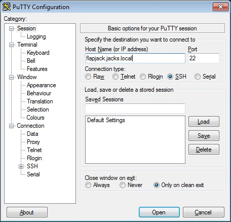
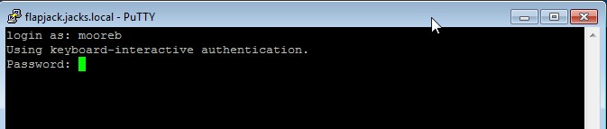
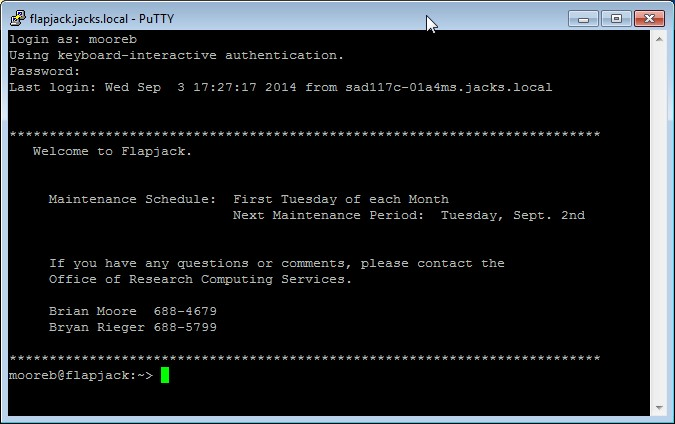

### Windows

You will need to download a program to make a command-line terminal
connection. A typical choice is PuTTY,
[*http://www.chiark.greenend.org.uk/\~sgtatham/putty/*.](http://www.chiark.greenend.org.uk/~sgtatham/putty/)
You can download and run the Windows installer, or you can just download
the executable of the program itself, putty.exe, and put it directly on
your desktop. When you start PuTTY, you will be presented with a
connection screen. Assuming you want to make your first connection to
flapjack, enter flapjack.jacks.local in the Host Name field.

When you click Open you should see the black PuTTY terminal window
appear and then a message similar to the following:

This message about the encryption key should appear only the first time
you connect to a given server from a particular computer. PuTTY is an
encrypted protocol, but the initial connection has to be made in the
clear to transfer the key. So click yes. Then you will see the login
prompt for the server. Enter your username and then your password. Note
that no characters will appear at all as you type the password.

When you have successfully logged in you will see the motd and the
command line system prompt.

