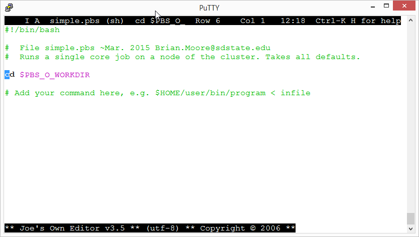
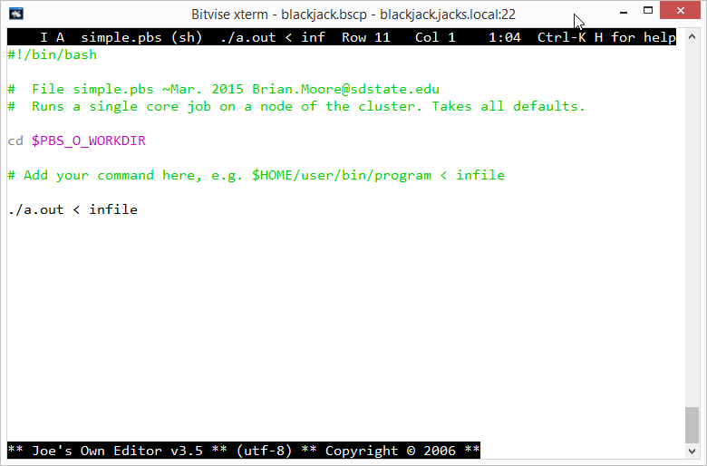

---
author:
- |
    Brian Moore\
    University Networking and Research Computing (UNRC)\
    [Brian.Moore@sdstate.edu](Brian.Moore@sdstate.edu)
title: |
     The Linux/UNIX command line\
    An introduction for users of the cluster and other Linux servers at
    South Dakota State University 
---

Overview
========

This is an outline document to help point users to information helping
with basic Linux/UNIX command line skills and other information related
to use of the SDSU shared-use servers. A few examples are given of
frequently used commands; comprehensive references are given in the
links. Special attention should be paid to the section on “Tracking
usage–yours and others,” because on a shared server your usage can
impact on others.

Other sources of local documentation
------------------------------------

To work through the examples here, you need an account on a Linux/UNIX
system; the specific output shown here is from `blackjack`, the
scheduler submit node of the main SDSU Linux cluster. Our link on the
public SDSU website is
<http://www.sdstate.edu/technology/UNRC/Cluster/index.cfm>. Information
is provided there on how to get an account, and how to get logged in
when you have your credentials, how to transfer files, etc.

More information on the cluster and UNRC is available on InsideState at
<https://insidestate.sdstate.edu/technology/infotech/Units/network-research/reference/>.
From this link, navigate to Research Computing and then the
Documentation folder. The `bigjack_intro` document summarizes most of
the information you need to get started.

To connect to the cluster and also InsideState, you need an sdstate
network account (email ending in `sdstate.edu`). If you are having
trouble accessing Insidestate, email
[brian.moore@sdstate.edu](brian.moore@sdstate.edu) to receive
documentation by email.

UNRC has a Listserv mailing list with periodic announcements for SDSU
research server Linux users. One way to view the list is to go to
<http://lists.sdstate.edu/scripts> and navigate to the
UNRC\_RESEARCHCOMPUTING list; you can view previous messages there, as
well as subscribe to the list.

Linux command line information–online sources
---------------------------------------------

Much information on UNIX/Linux command line skills is available via web
search. Try queries such as “linux command line tutorial.” Some links
that have looked good to me are:

-   <http://linuxcommand.org/>

-   <http://www.ee.surrey.ac.uk/Teaching/Unix/>

-   <http://www.pixelbeat.org/cmdline.html>

-   <http://community.linuxmint.com/tutorial/view/244>

One can also find printable sources, of varying depth. For a short one,
try Norm Matloff’s excellent site,
<http://heather.cs.ucdavis.edu/~matloff/UnixAndC/Unix/UnixBareMn.pdf>,
or for for much more detail, the full-sized book at
<http://linuxcommand.org/tlcl.php>.

Some initial commands to get started
====================================

Many of the initial commands to learn are related to navigating the file
system using the command line: listing, creating, deleting, moving
files, moving among subfolders, etc.

passwd
------

For “password.” One of the first things you should do when you first log
in to the system is to change your password. Use the `passwd` command
and it will first prompt you for your old password, then give you a
chance to choose a new one.

man
---

The `man` command is short for manual. For many important commands, you
can find more information by typing `man` followed by the command name,
e.g. `man ls`.

ls
--

The `ls` command will list your files in the directory where your
command prompt currently resides. The `ls` command alone will give a
short listing; this command, like many UNIX commands has many options
which can be invoked with a dash (see the man page for ls). Below is an
example.

    mooreb@blackjack:~/gsl> ls -al
    total 3120
    drwxr-xr-x   4 mooreb users    4096 2012-06-29 12:13 .
    drwxr-xr-x 145 mooreb users   12288 2015-02-26 16:41 ..
    drwxr-xr-x   6 mooreb users    4096 2012-06-29 12:13 1.14
    drwxr-xr-x  52 mooreb users    4096 2012-06-29 12:12 gsl-1.14
    -rw-r--r--   1 mooreb users 3163497 2012-06-29 11:58 gsl-1.14.tar.gz
    mooreb@blackjack:~/gsl>

This is the subfolder gsl of my home directory, /home/mooreb. It
contains two folders (1.14, and gsl-1.14) and one other file. When the
`ls` command has finished execution, the system prompt reappears.

cd
--

For “change directory.” When you log in your system prompt is in your
home directory, in my case `/home/mooreb`. In the example above, after I
logged in, I gave the command `cd gsl` to move into the vmd folder.

pwd
---

For “print working directory,” It reports where your system prompt is
currently located. For example:

    mooreb@blackjack:~> pwd
    /home/mooreb
    mooreb@blackjack:~> cd gsl
    mooreb@blackjack:~/gsl> pwd
    /home/mooreb/gsl
    mooreb@blackjack:~/gsl>

In the above example I start in my home folder, then changed to the
`gsl` folder, using pwd to check where I am before and after the cd
command.

mkdir
-----

For “make directory.” Example:

    mooreb@blackjack:~> mkdir testfolder
    mooreb@blackjack:~> cd testfolder
    mooreb@blackjack:~/testfolder> pwd
    /home/mooreb/testfolder
    mooreb@blackjack:~/testfolder> ls -al
    total 16
    drwxr-xr-x   2 mooreb users  4096 2015-03-03 10:43 .
    drwxr-xr-x 146 mooreb users 12288 2015-03-03 10:43 ..
    mooreb@blackjack:~/testfolder>

To remove a folder, the command is `rmdir`, but the folder must first be
empty; see also the `rm` command to delete files.

cp
--

For “copy.” Always needs at least two arguments, source and target.
Example:

    mooreb@blackjack:~/gsl> cp gsl-1.14.tar.gz /home/mooreb/testfolder
    mooreb@blackjack:~/gsl> cd ../testfolder
    mooreb@blackjack:~/testfolder> ls
    gsl-1.14.tar.gz
    mooreb@blackjack:~/testfolder>

Notice that there is more than one way to specify a file’s path and
name. If the file is in the folder where your system prompt is located
(the location given by `pwd`) then you need only give the name of the
file, as in the first argument above. If the file is in a different
folder, you can specify an absolute path, such as
`/home/mooreb/testfolder`, or a relative path, such as `../testfolder`.
In the second case, the `..` is an abbreviation for the folder one level
up from current.

For the `cp` command, if the last argument is a folder, all the
preceding files are copied *into* the folder.

### scp

For “secure copy” but more importantly *remote* secure copy. Similar to
`cp` but either source or target is on another system. See Wikipedia
article “Secure Copy.” Example: copying a file from blackjack to another
system:

    mooreb@blackjack:~> scp gsl/gsl-1.14.tar.gz mooreb@silvertip.jacks.local:
    Password:
    Password:
    gsl-1.14.tar.gz                             100% 3089KB   3.0MB/s   00:00
    mooreb@blackjack:~>

By default, the file will be copied to the top level folder of the user
specified on the remote system. This can be modified by adding
sub-folders on the remote end.

    mooreb@blackjack:~> scp fdt.jar mooreb@silvertip.jacks.local:folder/subfolder

Of course you must know that these folders exist on the target.

When invoking the `cp` or `scp` command, if the target name is a folder,
the file is put into the folder. If the target name does not exist, the
file is copied and given the target name.

Note that both cp and scp have a recursive option, `-r`, that will
operate on a folder instead of a file, and recursively copy the entire
tree.

The example given in this section is copying between two Linux systems.
You can also use scp to copy to/from a Windows system using a helper
program like WinSCP. See the instructions at
<http://www.sdstate.edu/technology/UNRC/Cluster/upload/Windows-CLI-Instructions.pdf>.

Command line completion
-----------------------

We can quickly type names like `gsl-1.14.tar.gz` and much longer with
only a few keystrokes. Most Linux systems (including ours) have a
command line completion feature, something like what you might do when
texting on a cell phone. Type a few characters of the name, then hit the
`tab` key, and it will complete with the longest string of unique
characters possible.

There is a nice Wikipedia article on command line completion at
<http://en.wikipedia.org/wiki/Command-line_completion>, with an animated
gif image showing the process in action.

mv
--

For “move.” Syntax is similar to `cp`, i.e. it takes at least two
arguments, but in this case the target (second argument) is replaced by
the source (first argument); if the target is a folder, the source
file/folder is put in that folder. If the target is a file, it is
overwritten. `mv` is also used to rename files.

rm
--

For “remove.” The `rm` command will silently remove (delete) the file
given after the command. Be careful! There is no “Trash” area; if you
remove a file by mistake, you may not be able to get it back. Sometimes
it is good to get in the habit of using the `-i` option with `rm`. Then
it will prompt you first.

    mooreb@blackjack:~/test2> ls
    CationPi.pl  du_out.txt  report1
    mooreb@blackjack:~/test2> rm -i report1
    rm: remove regular file `report1'? y
    mooreb@blackjack:~/test2>

rmdir
-----

For “remove directory.” The target directory must be empty.

wildcards
---------

The wildcard character `*` can be added to many of the previous
commands. For example, my `example/sleep` folder has many files that
begin with the string `sleep.pbs.o` (these are output files generated
each time the program is run with the PBS scheduler).

    mooreb@blackjack:~/examples/sleep> ls
    sleep.pbs         sleep.pbs.e31744  sleep.pbs.o14647
    sleep.pbs.e13760  sleep.pbs.e31745  sleep.pbs.o31744
    sleep.pbs.e14647  sleep.pbs.o13760  sleep.pbs.o31745
    mooreb@blackjack:~/examples/sleep>

To delete all files beginning with `sleep.pbs.o`:

    mooreb@blackjack:~/examples/sleep> rm sleep.pbs.o*
    mooreb@blackjack:~/examples/sleep> ls
    sleep.pbs         sleep.pbs.e14647  sleep.pbs.e31745
    sleep.pbs.e13760  sleep.pbs.e31744
    mooreb@blackjack:~/examples/sleep>

Wildcards can be used in many different ways, and the case above is just
a very simple example. For instance, `rm *.o*` would probably have also
accomplished the same effect.

Be careful using wildcards with the `rm` command without the `-i`
option!

more
----

Often you will want to view a plain text file. The simplest way is with
the `cat` command (e.g. cat filename). But if the file is too long for
the screen it will scroll off the top. Use the `more` command instead
and you can scroll through it slowly. Type the q key to get out of the
`more` pager. There are other pagers besides more. If you want to use a
pager where you can scroll both down *and* up in the file, try the
`less` pager.

Tracking usage–yours and others
===============================

When you log into blackjack, you have a session on the current
login/submit node of the SDSU cluster. As such we ask users to keep any
processes they run on blackjack short (not more than a few minutes) and
not too demanding in terms of CPU and RAM. You can test small instances
of your jobs on blackjack, but then when it comes time to run them
longer/bigger, use the PBS scheduler submit sytem to deploy the job to a
node of the cluster. If you want to run longer interactive jobs, not on
a node, you can use our test/development node, flapjack, or we can get
you an account on one of the non-cluster servers.

Hence, when running on any of the SDSU Linux servers, it is very
important to keep track of your own use and others of shared resources.
The main categories to watch are disk, cpu and RAM.

df
--

For “disk free.” It will report the usage on all mounted file systems. I
like using the `-h` option to get output in “human” terms (MB, GB).

    mooreb@blackjack:~> df -h
    Filesystem           Size  Used Avail Use% Mounted on
    /dev/sda2            266G  4.2G  249G   2% /
    udev                  24G  164K   24G   1% /dev
    tmpfs                 24G     0   24G   0% /dev/shm
    bigjack:/home/       9.9T  8.3T  1.2T  89% /home
    bigjack:/shared      266G  179G   75G  71% /shared
    bigjack:/sdsustor50  4.0T  1.8T  2.0T  47% /sdsustor50
    bigjack:/scratch     5.0T  847G  3.9T  18% /scratch
    mooreb@blackjack:~>

One thing to take notice of especially is the usage on `/home`, as that
is where all the users’ home folders are located. If you see /home
filling up send an email to me and/or Bryan Rieger. The scratch area is
for short-term storage for jobs about to run, currently running, or
recently finished. If you need more space to run a job requiring large
disk, email a request and we will create a folder for you on `scratch`.

du
--

For “disk usage.” It will report the usage of every subfolder of the
current folder, and give a grand total at the end. Keep an eye on your
usage. The `-h` switch gives the output in “human” terms (default is
kB).

    28K     ./Xtest
    8.0K    ./python3/lib/pkgconfig
    220K    ./python3/lib/python3.3/collections/__pycache__
    292K    ./python3/lib/python3.3/collections
    908K    ./python3/lib/python3.3/unittest/test/__pycache__
    596K    ./python3/lib/python3.3/unittest/test/testmock/__pycache__
    764K    ./python3/lib/python3.3/unittest/test/testmock
    [Lots of output deleted]
    12K     ./.cpanm/work/1422634306.9881/Acme-Time-Baby-2010090301/blib/meta
    4.0K    ./.cpanm/work/1422634306.9881/Acme-Time-Baby-2010090301/blib/man1
    4.0K    ./.cpanm/work/1422634306.9881/Acme-Time-Baby-2010090301/blib/bin
    104K    ./.cpanm/work/1422634306.9881/Acme-Time-Baby-2010090301/blib
    272K    ./.cpanm/work/1422634306.9881/Acme-Time-Baby-2010090301
    292K    ./.cpanm/work/1422634306.9881
    296K    ./.cpanm/work
    300K    ./.cpanm
    188G    .

quota
-----

The cluster uses a disk quota system.

    mooreb@blackjack:~> quotac
    Disk quotas for user mooreb (uid 1004):
         Filesystem  blocks   quota   limit   grace   files   quota   limit   grace
          /dev/sdc1 195091680  250000000 250000000          402547       0       0
    mooreb@blackjack:~>

The units are blocks; 1000 blocks 1 MB. To get GB, divide by $10^6$ or
take away 6 digits from the right. This reads (roughly) 195 GB used, and
250 GB quota.

top
---

The `top` command gives you an ongoing updated screen of all processes,
sorted by cpu usage. To exit from top, hit the q key.

    top - 11:01:58 up 2 days,  1:06,  3 users,  load average: 0.00, 0.01, 0.05
    Tasks: 186 total,   1 running, 185 sleeping,   0 stopped,   0 zombie
    Cpu(s):  0.0%us,  0.0%sy,  0.0%ni,100.0%id,  0.0%wa,  0.0%hi,  0.0%si,  0.0%st
    Mem:     48388M total,     9528M used,    38860M free,       80M buffers
    Swap:     2053M total,        0M used,     2053M free,     8585M cached

      PID USER      PR  NI  VIRT  RES  SHR S   %CPU %MEM    TIME+  COMMAND
      120 root      20   0     0    0    0 S      0  0.0   0:02.22 kworker/3:1
    10865 mooreb    20   0  8928 1220  848 R      0  0.0   0:00.01 top
        1 root      20   0 10548  836  704 S      0  0.0   0:01.42 init
        2 root      20   0     0    0    0 S      0  0.0   0:00.00 kthreadd
        3 root      20   0     0    0    0 S      0  0.0   0:00.49 ksoftirqd/0
        4 root      20   0     0    0    0 S      0  0.0   0:00.01 kworker/0:0
        6 root      RT   0     0    0    0 S      0  0.0   0:00.03 migration/0
    [Rest of output deleted]

This is a typical output for blackjack; very little is running that
shows up on cpu. If someone is running a process that creates a load, it
will show up, near the top, if the cpu usage is high. To demonstrate, I
ran an example, two core, cpu-intensive process:

    top - 14:39:53 up 24 days, 22:36,  2 users,  load average: 1.93, 0.98, 0.42
    Tasks: 232 total,   3 running, 229 sleeping,   0 stopped,   0 zombie
    Cpu(s):  8.3%us,  0.0%sy,  0.0%ni, 91.6%id,  0.0%wa,  0.0%hi,  0.0%si,  0.0%st
    Mem:     48260M total,     2125M used,    46135M free,      139M buffers
    Swap:     6147M total,        0M used,     6147M free,     1070M cached

      PID USER      PR  NI  VIRT  RES  SHR S   %CPU %MEM    TIME+  COMMAND
    24668 mooreb    20   0  181m 6540 3140 R    100  0.0   3:11.17 prime_mpi
    24669 mooreb    20   0  181m 6464 3076 R    100  0.0   3:11.21 prime_mpi
     4916 root      20   0  6712  664  384 S      0  0.0  11:25.19 irqbalance
    24747 mooreb    20   0  9076 1228  828 R      0  0.0   0:00.01 top
    [Rest of output deleted]

In this case, you can see that I am running two cpu intensive processes
on blackjack. Since there are a total of 12 processor cores, it is not
“full” in terms of cpu load yet. Again, we remind users to only run
short test jobs on blackjack itself. More demanding jobs should be run
on the nodes using the scheduler.

You can change the sort on top by using the &gt; (Shift-comma) or &lt;
(Shift-period) keys. Remember that you start on the CPU column by
default. For example, after bringing up top, then hitting the &gt; key
once, you will be sorting on memory.

Running a command in background, input and ouput redirect, etc.
===============================================================

Compiling a simple C program
----------------------------

To illustrate running in background, etc., I have provided a very simple
single-threaded example program on the cluster called `prime_ex` that
does a prime number search. The files should be located in my home
folder underneath the examples subfolder, i.e. in
`/home/mooreb/examples/C`.

### copying the example code

To compile the program yourself, you have to first copy the C source
code into your home folder or a subfolder you create. For example as
below:

    mooreb@blackjack:~> mkdir testprogram
    mooreb@blackjack:~> cd testprogram
    mooreb@blackjack:~/testprogram> cp /home/mooreb/examples/C/prime_ex.c  .
    mooreb@blackjack:~/testprogram> ls
    prime_ex.c
    mooreb@blackjack:~/testprogram>

### compiling the program

For this simple C program, use the gcc compiler:

    gcc prime_ex.c

This will create an executable file named `a.out`. You can rename
`a.out` to whatever you like (using `mv`), or you can add an option `-o`
in the compile to explicitly name the executable created by the compile.

This just scratches the surface–this is only the very simplest of
compile for one example language, C. For other languages, or programs
that require linking to libraries, or large complex programs, many more
options are available.

Running a program on the command line interactively
---------------------------------------------------

We will use the `prime_ex` program as an example for running
interactively. The program computes all the prime numbers less than or
equal to a given input number and writes back one line with the number
of primes found. So this particular program takes as input interactively
one integer number. To run this program for a small argument, from the
command line:

    mooreb@blackjack:~/testprogram> ./a.out
    Enter nmax:
    100
    Input nmax = 100
    The number of primes less than or equal to 100 is 25
    mooreb@blackjack:~/testprogram>

The program is written to write the prompt and wait for input. Then when
it receives the number and the user hits return, the program runs and
the output is written to the screen.

(Btw, to check if the program is correct, see for example
<http://primes.utm.edu/howmany.shtml>).

This program runs instantaneously when the input is 100; we can make
that number bigger and bigger and eventually it will take a while to
compute. So this is a small example of a program that would be useful to
run in background (and, eventually, on a worker node, not blackjack
itself).

### input redirect

Our very simple `prime_ex` program does not take much in input, just one
int, but some programs take very large input sets, so that it is
inconvenient to type them all on the command line. You can put your
inputs in a file and then redirect the file to the program as input.

To create an input file you can use an editor (see the section on
Linux/UNIX editors) or you can just do:\
`echo "1000" > infile`\
and it will create a textfile called `infile` with just the given echoed
characters in it. Then use this as input redirect:\
`./a.out < infile`

### output redirect

You will notice that when we run with input redirect, it still writes
the output to the screen. We can make that output go to a file instead
with an output redirect.

    ./a.out < infile &> outfile

Then you can use the `more` command to check the contents of the output
file.

Note that output redirect does not have to be combined with putting the
job in background. For example `ls -al /home > lsfile` will put what
would have been produced by `ls -al` (a long listing of `/home`) into
the file `lsfile`; in this case there is no point of putting the job in
background since it runs so fast.

Running a program in background
-------------------------------

Running from the command line is no problem if the program finishes
right away, but what if you want to run a program that takes a long
time? You don’t want it to hold up the terminal. For our example
program, you can try slowly ramping up the value of your input integer
and you will see it start to take time to finish. How long depends on
system load. I found somewhere around 500000 it started to have a
noticeable delay.

    mooreb@blackjack:~/testprogram> echo "500000" > infile
    mooreb@blackjack:~/testprogram> ./a.out < infile &> outfile

Now it just sits there, with the terminal held up, until it finishes. If
you hit Ctrl-C the program will terminate.

You can start a program and put it in background by appending the
ampersand symbol, `&`, after the program name and inputs.

    mooreb@blackjack:~/testprogram> ./a.out < infile &> outfile &
    [1] 11220
    mooreb@blackjack:~/testprogram>

Now it responds with a number for the process and puts you back to the
system prompt. While the program is running, the terminal is freed up
for new commands for you to type while the program is running. If it is
a very long process, you can even log off and it will still run in
background. When the program is done, it will write to the redirected
output file, just as before.

Note the response when you put the job in background; two numbers. The
first, `[1]`, is the number of the process in terms of background
processes attached this terminal. The second one, `11220` is the process
ID (PID) on the system in general.

Killing a process
-----------------

You can kill a process with the `kill` command. The most general way is
to know the PID number associated with the process (e.g. the number
11220 above, shown when put in background). If you don’t know the PID of
your process you want to kill, you can use the `top` command to try and
find it. To limit the output of top, you can use the `-u` option, which
restricts the display to a named user, e.g. `top -u mooreb`.

Piping command output to another command
----------------------------------------

You can send the output of any commands that produces text into another
appropriate command. For example, if you were to list all the entries in
/home, long listing you would use `ls -al /home`. You notice that the
entries are too many for the screen. So instead use:

    ls -al /home | more

and it will display the output through the `more` pager. This is just
one simple example of piping! It can get much more detailed and
complicated if necessary.

Using a simple text editor in the terminal
==========================================

You will usually need to be able to perform some simple text editing on
your input or other files on the system. Here we will take as an example
copying a basic simple PBS script and editing it to add the command to
our simple, single-core, prime number finder.

Working with this same example, we had the program in a folder beneath
the home directory called testfolder. Copy a simple PBS script into that
folder:

    mooreb@blackjack:~> cp /home/mooreb/examples/simple/simple.pbs testprogram/
    mooreb@blackjack:~> cd testprogram
    mooreb@blackjack:~/testprogram> ls
    a.out  infile  outfile  prime_ex.c  simple.pbs
    mooreb@blackjack:~/testprogram>

Now, open the file `simple.pbs` in a text editor. We chose the joe
editor because it is simple, but you can use vi if you are familiar with
it also.

    mooreb@blackjack:~/testprogram> joe simple.pbs

You should see something like the following:

{width="5.0in"}

At this point you can move the cursor around with the arrow keys and
type text or delete characters, etc. I don’t use joe frequently, but the
only thing I need to know is always right on the screen, top right:
Ctrl-K H for help. If you hit those keys it will bring up a few lines of
help. Repeating Ctrl-K H will make the help menu disappear.

Here we want do to just a simple edit: add the line to run our program.
So, position your cursor on a line below the last line (lines beginning
with \# are comments) and type:

    ./a.out < infile

When you are done, the screen should look something like:

{width="5.0in"}

Then use Ctrl-K X to save the file. Once you have the editor closed, you
can use the `more` command to check the contents and make sure the edit
was done how you wanted.

Why did we not use the exact command we had used on the command line,
which was `./a.out < infile &> outfile &`?

First, you *don’t* want to put your job in background in the scheduler
script as it defeats the whole point of the scheduler. When we run on
the node, using PBS, you will see the job is automatically put in a
batch mode, so there is no reason to put it in background.

Second, the scheduler will automatically produce an output file, so we
don’t need to re-direct the output. We could, but for such a small job,
here there is no need.

Submitting a PBS script
=======================

Note that we have a separate set of documentation with more detail on
how to use the Moab/PBS scheduler. The section here is just to get you
started on a very simple example.

Now, if we are in the folder that has the submit script, and the
program, and the input file, we use the `qsub` command to submit the
job.

    mooreb@blackjack:~/testprogram> qsub simple.pbs
    32873.bigjack

It responds with a number, which is our job number. Assuming the job
does not finish immediately, we can use some helper commands to check on
the status. The `qstat` command will show our currently running (or
recently ended) jobs.

    mooreb@blackjack:~> qstat
    Job ID                    Name             User            Time Use S Queue
    ------------------------- ---------------- --------------- -------- - -----
    32873.bigjack              simple.pbs       mooreb                 0 R batch

This does not seem to tell us much, but the most important thing to note
is the “R” underneath the S (for status), which means the job is
running. Other commonly seen codes are C (Complete), E (error) or Q
(queued).

To see all the jobs running in the scheduler you can use `showq`:

    mooreb@blackjack:~> showq

    active jobs------------------------
    JOBID              USERNAME      STATE PROCS   REMAINING            STARTTIME

    32873                mooreb    Running     1    00:59:42  Thu Mar  5 12:52:33
    32842                nagele    Running    12  5:20:52:00  Wed Mar  4 09:44:51
    32843                nagele    Running    12  5:20:52:30  Wed Mar  4 09:45:21

    3 active jobs            25 of 732 processors in use by local jobs (3.42%)
                               3 of 61 nodes active      (4.92%)

Here we see our job running, having been listed as asking for one
process (the default). Note the time remaining, just nearly an hour;
that is because our walltime limit was the default of one hour, and
we’ve used just a little bit of it.

Now, if all goes well and the job finishes, you should have two new
files in your folder:

    mooreb@blackjack:~/testprogram> ls
    a.out   outfile     simple.pbs   simple.pbs.e32873
    infile  prime_ex.c  simple.pbs~  simple.pbs.o32873
    mooreb@blackjack:~/testprogram>

The two new files have the name of the script, appended by the job
number preceded either by the character `o` (for output) or `e` for
error.

Use `more` to look inside the output file.

    mooreb@blackjack:~/testprogram> more simple.pbs.o32873
    Enter nmax:
    Input nmax = 500000
    The number of primes less than or equal to 500000 is 41538
    mooreb@blackjack:~/testprogram>
