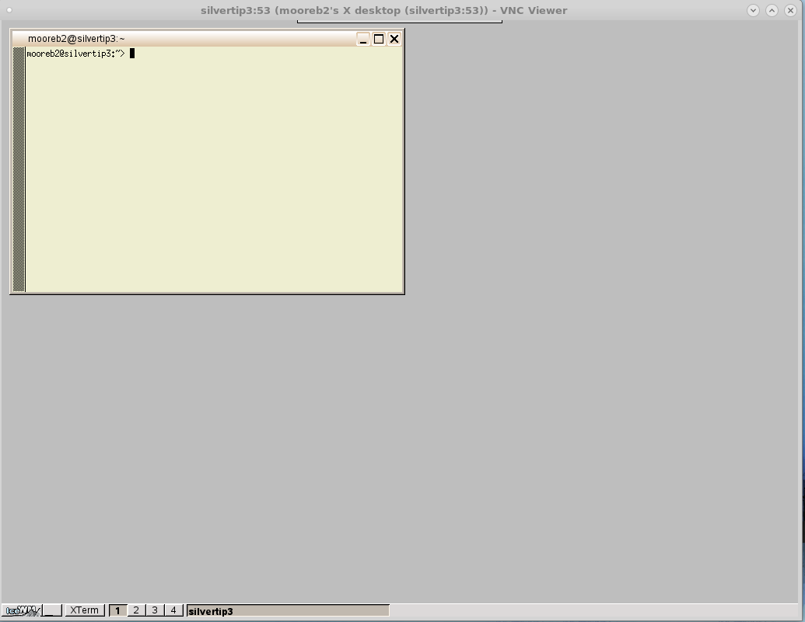

---

VNC (remote graphics) sessions to Linux servers
===

[Brian.Moore@sdstate.edu](Brian.Moore@sdstate.edu)  University Networking and Research Computing (UNRC)

---


Starting VNC--persistent session
========================

Log into the server with a command-line shell, for example on Windows with the PuTTY application.  Then start your session with the `vncserver` command.

``` {.console}
mooreb2@silvertip3:~> vncserver

You will require a password to access your desktops.

Password:
Verify:   
Would you like to enter a view-only password (y/n)? n
xauth:  creating new authority file /home/mooreb2/.Xauthority

New 'X' desktop is silvertip3:53

Creating default startup script /home/mooreb2/.vnc/xstartup
Starting applications specified in /home/mooreb2/.vnc/xstartup
Log file is /home/mooreb2/.vnc/silvertip3:53.log

mooreb2@silvertip3:~>
```

You should only see the dialog prompting you to see the VNC password the first time you use VNC. The password for the VNC session is different from your system password.  

Note your screen number, in the example above it is screen 53 on silvertip, or `silvertip:53`.


Connecting to the VNC session with a VNC viewer
==============================================

You need a VNC viewer program to connect to your VNC session.  A typical one is from RealVNC; the viewer is free.  Search for "realvnc viewer download," for example, <https://www.realvnc.com/en/connect/download/viewer/>.  Download and install the VNC client for your operating system.

Open the VNC view program and connect to the session you created.


If you successfully make the connection, you will be warned that it is not encrypted, and then asked to enter your VNC password (remember, NOT your system password).  An example of a starting session on `silvertip3` is shown below.




Killing the VNC session
========================

The VNC session created in this example is persistent. This means that
you can close the VNC viewer program and the session remains active,
even though it is not being viewed. (Don’t log out inside the VNC
session, however; that *will* kill the session).

To kill your VNC session you must be logged in from the command-line (e.g. PuTTY) session and issue a `vncserver -kill` command; the argument is your screen number.

```{.console}
mooreb2@silvertip3:~> vncserver -kill :53
Killing Xvnc process ID 54279
mooreb2@silvertip3:~>
```

Finding your VNC sessions
-------------------------

If you don't know your screen number, you can find your running sessions from the command line.

```{console}
mooreb2@silvertip3:~> ps aux | grep mooreb2 | grep vnc
mooreb2  55813  2.1  0.0  91268 14988 pts/65   S    16:18   0:00 Xvnc :46 -desktop X -httpd /usr/share/vnc/classes -auth /home/mooreb2/.Xauthority -geometry 1024x768 -depth 24 -rfbwait 120000 -rfbauth /home/mooreb2/.vnc/passwd -rfbport 5946 -fp /usr/share/fonts/misc:unscaled,/usr/share/fonts/local,/usr/share/fonts/75dpi:unscaled,/usr/share/fonts/100dpi:unscaled,/usr/share/fonts/Type1,/usr/share/fonts/URW,/usr/share/fonts/Speedo,/usr/share/fonts/truetype,/usr/share/fonts/uni,/usr/share/fonts/CID -noreset
mooreb2  55852  0.0  0.0   5716   812 pts/65   S+   16:18   0:00 grep vnc
mooreb2@silvertip3:~>
```

In the example above in place of `mooreb` use your own username.  In this case we found that screen 46 was active.  It is important to look for your running VNC sessions because frequently people start them and forget them, as you can see on silvertip3 we have 50 or more sessions, most of which have probably been long forgotten by their users.
