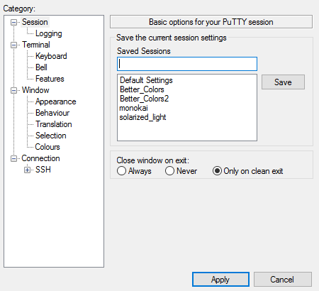
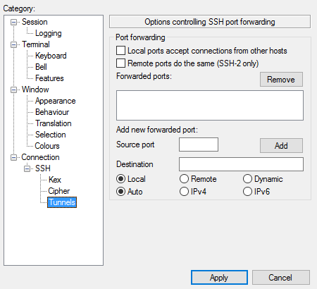
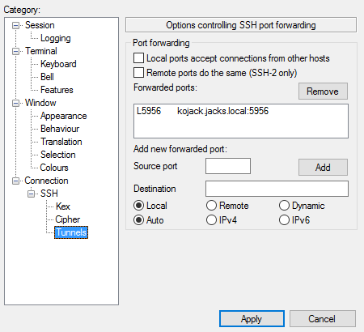
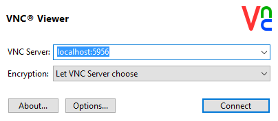

---

VNC using an ssh tunnel
===

[Brian.Moore@sdstate.edu](Brian.Moore@sdstate.edu)  University Networking and Research Computing (UNRC)

---

Using the Windows PuTTY program to configure tunneling
(through port 22) to access to a persistent VNC session.

PuTTY settings to tunnel VNC port
=================================

Open a PuTTY session and make a connection to `kojack`.

In the open PuTTY window, you can right click on the window bar at the
top to bring up the menu. Navagate to the *Change Settings* menu. Click
the *Tunnels* option under the *SSH* category.

|   Putty main screen         |    SSH tunnels options   |
| :-------------------------: | :----------------------------------: |
|  |  |

In the *Source Port* field enter the local port. In this example we will
use 5956, to match the remote port. In the *Destination* field, enter
`kojack.jacks.local:5956` (for this example–use own VNC port here.

Click the *Add* button and then click *Apply*.

VNC session to tunneled port
============================

Open the VNC viewer program. In the server field, now put
`localhost:5956` (use your own VNC port in place of the example).

This should then connect you to your VNC session on `kojack`. You will
be prompted for your VNC password.

Saving the session with the tunnel configuration
================================================

If you want to have the tunnel run every time you start PuTTY, you can
go to the *Session* section and save the session, giving it a new name,
before you quit your PuTTY session.
